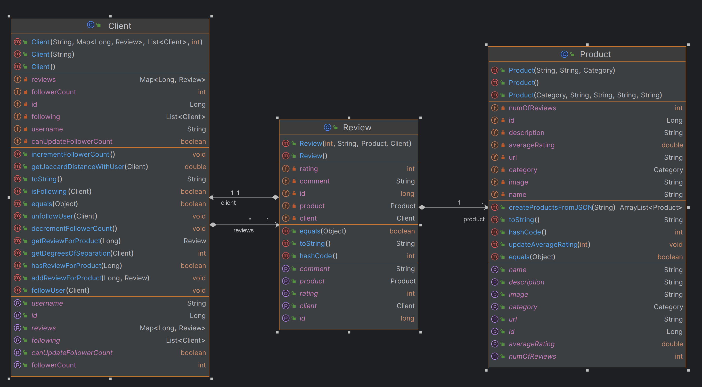
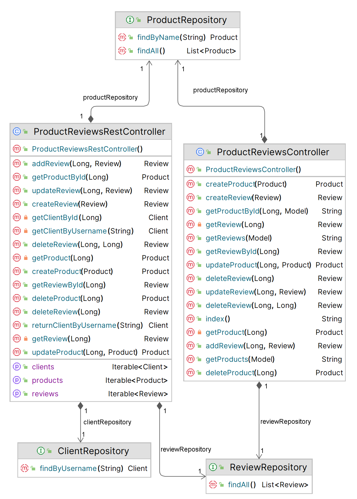
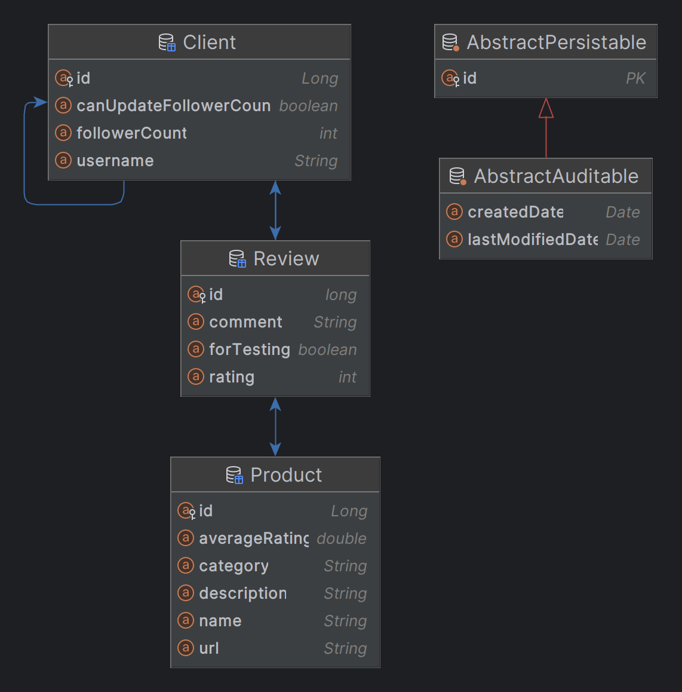

# ProductReviewsWebApp

Web app link - http://productreviewswebapp.azurewebsites.net

This Product Reviews Web App is a SpringBoot web application deployed on Azure Web Services. It uses RESTful commands 
and Thymeleaf calls to organize and display information that is persisted and stored in a database.

## Working Technology Stack

 
     
    
    
    
    

## Description
Product reviews on the platform are linked to their respective website listings. Each review comprises a star rating 
and accompanying text. Users have the option to 'follow' others whose reviews they find valuable. They can then organize
products within a specific category by their average rating, considering either all users or just those they follow. 
Additionally, users can identify individuals whose reviewing patterns closely resemble their own using the Jaccard 
distance metric. Reviews can be further ranked based on the similarity of the reviewers' scores. The platform also 
allows users to discover the most followed reviewers. To enhance trust, the system indicates the degree of separation 
between users through their 'follow' connections, assuming closer connections imply higher trustworthiness.

## This project contains three entities:

### Product

The product entity is responsible for holding the model logic of a typical Product. It contains a name, URL, category, 
and a list of Reviews related to that product. Users can add and remove products to the site.

### Review

The review entity holds the model logic of a typical Review. It contains a star rating and a comment and keeps track of 
the review's author and related product. 

### Client

The client entity is responsible for holding the model logic of the typical client. Clients have a username, a map of 
`product_id`, review pairs, a list of users they follow, and a count of how many users follow them - using *Degrees of Separation*. 
Clients can follow and unfollow other clients, write reviews of products, and calculate *Jaccard Distance* to each other.

## Sprint Plan

Sprint plans are focused on achieving the main feature and functionality of the project completed such as:
- acceptable user-interface to display relevant entities of the project model
- Jaccard distance between users
- Degrees of separation between followers
- Prometheus and Grafana work on the Azure cloud platform.

All the planned issues can be found here:
* [Milestone 1](https://github.com/NathanMacDiarmid/ProductReviewsWebApp/milestone/1)
* [Milestone 2](https://github.com/NathanMacDiarmid/ProductReviewsWebApp/milestone/2)
* [Milestone 3](https://github.com/NathanMacDiarmid/ProductReviewsWebApp/milestone/3)

### UML Class Diagram - model

### UML Class Diagram - controller

### Entity Relationship Diagram

## Run locally

- Clone the repository to your machine and run the `ProductReviewsWebAppApplication.java` file
- On any web browser, navigate to `localhost:8080`, allowing an offline developer view of the project

## Run with Prometheus and Grafana monitoring

Prometheus and Grafana can be used to query and visualize a variety of app metrics. In order to get them working complete the following steps:

- Install docker on your machine ([docker installation webpage](https://docs.docker.com/engine/install/) or `sudo apt install docker.io` on debian)
- Install docker compose on your machine ([docker compose installation site](https://docs.docker.com/compose/install/))
- Run `mvn package` in the project root directory to ensure that the latest version of the project jar file is present
- Open the terminal, navigate to the monitoring directory and run `docker-compose up -d` or `docker compose up -d` (depending on how docker compose was installed, docker-compose may not work as sometimes docker compose is included in the docker installation instead of installed individually)
- Navigate to URL:
  - `http://localhost:8080` for the Product Reviews Web App
  - `http://localhost:9090` for the Prometheus user interface
  - `http://localhost:3000` for the Grafana user interface
- Once you are done, navigate to the monitoring directory again and run `docker-compose down` to stop the containers

## Contribute

- Once changes are made, re-run `ProductReviewsWebAppApplication.java` and refresh `localhost:8080` on your web browser, the changes should appear
- Create a new branch and commit to the repository
- Open a pull request on that branch, once approved, congratulations, you've successfully contributed to Product Reviews Web App!
